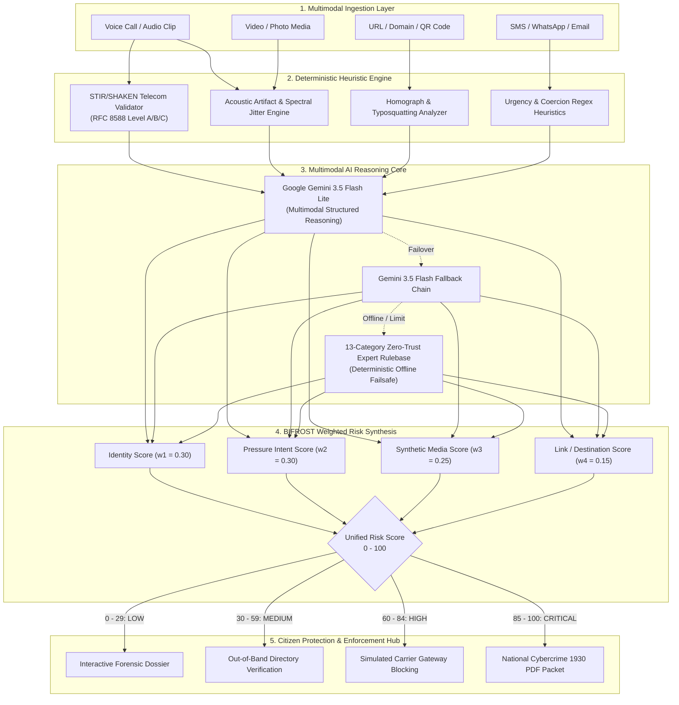

# 🛡️ BIFROST: VERITY — Multimodal AI Impersonation & Fraud Prevention

<div align="center">


<p align="center">
  <b>Developed by Team BIFROST</b><br>
  <i>A unified multimodal zero-trust cyber defense platform protecting citizens and enterprises against deepfake voice cloning, digital arrest extortion, synthetic media coercion, and telecom spoofing.</i>
</p>

</div>

---

## 📑 Table of Contents
- [1. The Problem](#1-the-problem)
- [2. The Solution](#2-the-solution)
- [3. Model Architecture](#3-model-architecture)
- [4. Key Features](#4-key-features)
- [5. Technology Stack](#5-technology-stack)
- [6. Live Production Demos (Local Development - Backend & Setup Frontend)](#6-live-production-demos-local-development---backend--setup-frontend)
- [7. Citations & Credits](#7-citations--credits)

---

## 1. The Problem

The hyper-democratization of Generative AI has dramatically shifted the cyber threat landscape. Criminal syndicates and state-sponsored bad actors no longer rely on misspelled emails or rudimentary robocalls. Today's fraud attacks are **multimodal, hyper-personalized, and psychologically weaponized**:

```
                              THE MODERN THREAT MATRIX
  ┌─────────────────────────────────────────────────────────────────────────────┐
  │ 🎙️ AI Voice Cloning   │ 3-5 sec reference audio clones family/executive     │
  │ 👮 Digital Arrest      │ Fake CBI/ED Skype trials coerced via legal panic   │
  │ 🎭 Synthetic Media     │ Real-time deepfakes spoofing Video KYC & biometrics │
  │ 📞 Telecom Spoofing    │ Unauthenticated VoIP spoofing official bank numbers│
  │ 🔗 Lookalike Domains   │ Homograph Unicode URLs harvesting 2FA tokens & OTPs│
  └─────────────────────────────────────────────────────────────────────────────┘
```

### Critical Vectors Threatening Everyday Citizens:
1. **The "Digital Arrest" Epidemic**:
   - Organized syndicates pose as police officers, Customs, or the Central Bureau of Investigation (CBI) over WhatsApp/Skype video calls.
   - Using fabricated interrogation rooms, forged arrest warrants, and intimidation, victims are held "incommunicado" under the psychological illusion of a legal arrest until life savings are liquidated to "escrow accounts."
2. **Sub-Second AI Voice Cloning (Vishing)**:
   - Scammers scrape short audio snippets from Instagram reels, LinkedIn talks, or voicemails to train zero-shot voice cloning diffusion models.
   - Calls simulate kidnapped family members or executives in immediate medical distress, demanding immediate UPI/wire transfers.
3. **Multimodal Biometric & KYC Impersonation**:
   - Deepfake video feeds bypass real-time liveness checks in financial institutions, allowing unauthorized credit generation and mule account creation.
4. **Telecom Authentication Asymmetry**:
   - Legacy cellular networks allow SIP gateways to forge caller IDs. Without localized verification against STIR/SHAKEN standards, recipients cannot distinguish between official bank helplines and criminal spoofers.
5. **The Response Latency Problem**:
   - By the time a citizen calls an official helpline or local police, irreversible wire transfers and credential leaks have already occurred. Users require **instant, real-time forensic interception** at the edge.

---

## 2. The Solution

**VERITY**, built by **Team BIFROST**, is an automated, multimodal Zero-Trust defense engine designed to detect, analyze, and neutralize social engineering threats across all communication channels in real time.

VERITY does not rely on subjective human instinct. Instead, it systematically interrogates every incoming interaction across **four foundational zero-trust pillars**:

```
                         THE VERITY QUADRANT DEFENSE
  
       [ WHO IS CONTACTING YOU? ]             [ WHAT IS COMMUNICATED? ]
       • Carrier & VoIP Route Analysis        • Extortion & Panic Detection
       • STIR/SHAKEN Attestation Grade        • False Authority Impersonation
       • Known Mule & Bad-Actor Ledger        • Secrecy & Isolation Mandates
                     │                                      │
                     └──────────────────┬───────────────────┘
                                        ▼
                           [ BIFROST WEIGHTED ENGINE ]
                             Unified Risk: 0 — 100
                                        ▲
                     ┌──────────────────┴───────────────────┐
                     │                                      │
       [ WHAT ARE YOU ASKED TO DO? ]          [ CAN IT BE TRUSTED? ]
       • Emergency Wire / UPI Transfers       • Cross-Channel Directory Check
       • Remote Control APK Installation      • Automated 1930 Dossier Export
       • OTP & Credential Harvesting          • Instant Gateway Intercept
```

### Core Tenets of the BIFROST Solution:
- **Zero-Trust Telemetry**: Assume every unverified voice, message, and caller identity is hostile until verified by cryptographic and heuristic proof.
- **Multimodal Forensics**: Ingest and inspect voice calls, audio clips, video clips, documents, text messages, and web links through unified multimodal pipelines.
- **Explainable Threat Dossiers**: Every scan generates plain-language, evidence-backed explanations showing exactly *why* a call or link was marked suspicious.
- **Tactical Incident Mitigation**: One-click direct countermeasures: **Independent Directory Verification**, **Carrier-Level Number Blocking**, and **Direct 1930 Cybercrime Reporting**.
- **Offline & Low-Bandwidth Resilience**: Dual-tier architecture ensuring zero-trust intelligence operates smoothly even during connectivity dropouts.

---

## 3. Model Architecture

The BIFROST architecture combines real-time telecom heuristics, acoustic forensics, link reputation algorithms, and Google's latest multimodal Gemini 3.5 AI reasoning engine:



### The BIFROST Weighted Risk Formulation:
The final interaction risk score $R \in [0, 100]$ is computed as:

$$\mathbf{R} = \sum_{i=1}^{4} w_i \cdot S_i + \delta_{\text{critical}}$$

Where:
- $S_{\text{identity}}$ ($w_1 = 0.30$): STIR/SHAKEN attestation, SIP route anonymity, brand impersonation ratio.
- $S_{\text{pressure}}$ ($w_2 = 0.30$): Psychological urgency, legal threat severity, isolation commands.
- $S_{\text{synthetic}}$ ($w_3 = 0.25$): Acoustic spectral anomalies, deepfake facial blend seams, synthetic speech markers.
- $S_{\text{destination}}$ ($w_4 = 0.15$): Homograph distance, suspicious TLD, mule account flags.
- $\delta_{\text{critical}}$: Dynamic boost triggered when hard flags occur (e.g., OTP solicitation or remote APK command).

---

## 4. Key Features

| Category | Capability | Description |
| :--- | :--- | :--- |
| **Multimodal Scanning** | **All-in-One Forensics** | Seamless analysis across **Voice**, **Text Messages**, **Media Files**, and **Web URLs** with instant risk breakdowns. |
| **Real-Time Call Shield** | **Live Inbound Interceptor** | Simulates active inbound call monitoring with live audio transcription, acoustic biometric wave graphs, and instant hangup recommendations. |
| **Telecom Verification** | **STIR/SHAKEN Telemetry** | Verifies carrier attestation (Full Attestation Level A vs Gateway Level C), exposing number spoofing. |
| **AI Security Copilot** | **24/7 Zero-Trust Advisor** | Interactive chatbot answering user questions regarding suspicious scenarios, Digital Arrest scripts, and device recovery. |
| **Dual Viewports** | **Desktop & Mobile Parity** | Fully responsive console offering a mobile layout with **Logo Dropdown Options**, a **Save state button beside the avatar photo**, and a **Unified 6-Tab Bottom Bar**. |
| **State Persistence** | **One-Tap Save** | Preserves user profile verifications, custom scan history, and settings to local storage with immediate visual feedback. |
| **Evidence Packet** | **PDF Audit Export** | Exports forensic audit dossiers with cryptographic scan IDs, quadrant risk breakdowns, and timestamped evidence. |
| **Action Suite** | **Mitigation Modals** | Direct action modals to **Verify Independently** via official switchboards, **Block Senders** across carrier gateways, and **Report to 1930 Helpline**. |

---

## 5. Technology Stack

### Backend Architecture
```
backend/
├── app/
│   ├── api/v1/
│   │   ├── endpoints/
│   │   │   ├── analyze.py          # Multimodal aggregation endpoint
│   │   │   ├── audio.py            # Speech-to-text & acoustic forensics
│   │   │   ├── call_protection.py  # Real-time telephony session shield
│   │   │   ├── copilot.py          # AI Security Copilot with Gemini 3.5
│   │   │   ├── incidents.py        # SQLite audit history & feedback loop
│   │   │   ├── media.py            # Image & video deepfake detection
│   │   │   ├── text.py             # SMS & text impersonation heuristics
│   │   │   └── url.py              # Phishing & homograph attack analyzer
│   │   └── router.py               # Main API v1 router
│   ├── core/
│   │   └── config.py               # Settings & environmental config
│   ├── db/
│   │   ├── database.py             # Async SQLite SQLAlchemy session
│   │   └── models.py               # Audit log & incident telemetry models
│   ├── services/
│   │   ├── call_demo_simulator.py  # Realistic telecom attack scenario generator
│   │   ├── gemini_service.py       # Google GenAI SDK integration & prompt engineering
│   │   └── risk_engine.py          # 4-quadrant weighted risk scoring
│   └── main.py                     # FastAPI application root & middleware
└── requirements.txt
```

### Frontend Architecture
```
frontend/
├── src/
│   ├── components/
│   │   ├── AIChatbot.tsx           # Floating AI Security Copilot
│   │   ├── AnalysisResultView.tsx  # Detailed forensic dossier view
│   │   ├── AnalyzeHubView.tsx      # Multi-vector scanning launchpad
│   │   ├── CallProtectionView.tsx  # Live call intercept simulator
│   │   ├── Header.tsx              # Desktop top navigation header
│   │   ├── HistoryView.tsx         # Audit log ledger & search
│   │   ├── MobileBottomNav.tsx     # 6-tab unified mobile navigation
│   │   ├── MobileDashboardView.tsx # Mobile overview screen
│   │   ├── MobileHeader.tsx        # Mobile header with logo options & save
│   │   └── UserProfileDrawer.tsx   # Verified citizen profile drawer
│   ├── utils/
│   │   ├── apiService.ts           # FastAPI HTTP client with failover
│   │   ├── callProtectionService.ts# Live telephony state machine
│   │   └── pdfExport.ts            # Forensic PDF audit generation
│   └── App.tsx                     # Main layout & responsive viewport controller
├── package.json
└── vite.config.ts
```

### Core Technologies

| Layer | Technology | Version | Purpose |
| :--- | :--- | :--- | :--- |
| **AI & LLM** | **Google Gemini 3.5 Flash Lite** | `gemini-3.5-flash-lite` | Primary multimodal reasoning, threat categorization, and JSON schema extraction |
| **AI Failover** | **Google GenAI SDK** | `0.1.1+` / `@google/genai 2.4.0` | Official client library for Gemini models with multi-model failover chains |
| **Backend Framework** | **FastAPI** | `>= 0.115.0` | High-performance asynchronous REST API server |
| **Web Server** | **Uvicorn** | `>= 0.32.0` | ASGI web server with auto-reload and daemon support |
| **Database** | **SQLite + aiosqlite** | `>= 0.20.0` | Asynchronous embedded storage for audit trails and threat feedback |
| **ORM** | **SQLAlchemy** | `>= 2.0.35` | Object-relational mapping for forensic incident records |
| **Frontend Framework**| **React** | `19.0.1` | Reactive declarative user interface |
| **Language** | **TypeScript** | `5.0+` | Full end-to-end type safety |
| **Build Tool** | **Vite** | `8.3.3` | Next-generation ultra-fast frontend build engine |
| **Styling** | **Tailwind CSS** | `4.3.3` | Utility-first cyber-defense styling with glassmorphism & dark/light themes |
| **Icons & UI** | **Lucide React** | `0.546.0` | Modern, clean vector iconography |
| **Export Engine** | **jsPDF + AutoTable** | `4.2.1` | Native client-side PDF forensic dossier generator |

---

## 6. Live Production Demos (Local Development - Backend & Setup Frontend)

Follow these instructions to run the entire BIFROST VERITY platform locally.

### Prerequisites
- **Python**: Version `3.10` or higher (`python --version`)
- **Node.js**: Version `18.0` or higher (`node --version`)
- **Package Manager**: `npm` or `yarn`
- **Google Gemini API Key**: Obtain a key from [Google AI Studio](https://aistudio.google.com/)

---

### Step 1: Clone the Repository
```bash
git clone https://github.com/Siddharths99/Verity.git
cd Verity
```

---

### Step 2: Backend Setup & Execution

1. **Navigate to the Backend Directory**:
   ```bash
   cd backend
   ```

2. **Create and Activate a Virtual Environment**:
   - On Windows (PowerShell):
     ```powershell
     python -m venv .venv
     .\.venv\Scripts\Activate.ps1
     ```
   - On Linux / macOS:
     ```bash
     python3 -m venv .venv
     source .venv/bin/activate
     ```

3. **Install Dependencies**:
   ```bash
   pip install -r requirements.txt
   ```

4. **Configure Environment Variables**:
   Create a `.env` file in the root directory (or inside `backend/`):
   ```env
   PROJECT_NAME="VERITY - Multimodal AI Impersonation & Fraud Prevention"
   DEBUG=True
   DATABASE_URL="sqlite+aiosqlite:///./verity.db"
   GEMINI_API_KEY="your_actual_google_gemini_api_key_here"
   GEMINI_MODEL="gemini-3.5-flash-lite"
   ALLOWED_ORIGINS="http://localhost:3000,http://127.0.0.1:3000,http://localhost:5173,http://127.0.0.1:5173"
   ```

5. **Start the FastAPI Server**:
   ```bash
   python -m uvicorn app.main:app --host 127.0.0.1 --port 8000 --reload
   ```

   - **API Root**: `http://127.0.0.1:8000`
   - **Health Check**: `http://127.0.0.1:8000/api/v1/healthz`
   - **Interactive API Docs (Swagger UI)**: `http://127.0.0.1:8000/docs`

---

### Step 3: Frontend Setup & Execution

1. **Open a New Terminal and Navigate to `frontend/`**:
   ```bash
   cd frontend
   ```

2. **Install Node Dependencies**:
   ```bash
   npm install
   ```

3. **Configure Frontend Environment (Optional)**:
   Ensure `frontend/.env` points to the running backend:
   ```env
   VITE_API_BASE_URL="http://127.0.0.1:8000"
   ```

4. **Start the Vite Development Server**:
   ```bash
   npm run dev
   ```

5. **Open in Browser**:
   Open **`http://localhost:3000/`** in your browser.

---

### Step 4: Verification & Testing Scenarios

#### Scenario A: Test the AI Copilot with a Custom Scenario
Open the **AI Security Copilot** (bottom right floating button) and ask:
> *"I received a Skype video call from an officer claiming to be CBI Officer Suresh Patel saying an arrest warrant is out against me for money laundering. What should I do?"*

- **Expected Response**: Real-time identification of the **"Digital Arrest" Extortion Scam**, zero-trust reassurance that police never arrest citizens via video calls, direct instructions to disconnect and block, and official links to the **1930 National Cybercrime Helpline**.

#### Scenario B: Mobile Mode Exploration
1. Click the **Mobile UI** switch in the top right (or resize browser width below 768px).
2. Tap the **VERITY Logo** in the mobile header:
   - Verify that Theme Toggle, Change Password, Change Number, and Export PDF appear.
3. Tap the **Save** button beside the photo logo:
   - Notice the animated `Saved ✓` state, state persistence, and automatic PDF download.
4. Tap the **Avatar Photo Logo**:
   - Opens the User Profile Drawer displaying verification badges.
5. Use the **6-Tab Bottom Navigation** (Home, Analyze, History, Alerts, Calls, Settings).

#### Scenario C: Live Telecom Call Interceptor
1. Navigate to the **Calls** tab (or **Call Protection** on desktop).
2. Observe the simulated inbound suspicious call from `+91 98401 24590`.
3. Watch the acoustic biometrics wave monitor, speech transcription, and STIR/SHAKEN gateway analysis detect VoIP spoofing in real time.

---

## 7. Citations & Credits

### 👥 Team BIFROST
- **Project Name**: VERITY — Multimodal AI Impersonation & Fraud Prevention System
- **Mission**: Delivering zero-cost, enterprise-grade multimodal fraud immunity to every citizen.

### 📚 Standards, Regulations & Research Citations
1. **NIST SP 800-207**: *Zero Trust Architecture*, National Institute of Standards and Technology (NIST), U.S. Department of Commerce.
2. **IETF RFC 8588 / RFC 8224**: *Personal Assertion Token (PASSporT) Extension for STIR & SHAKEN Framework for Telecom Identity Management*.
3. **Ministry of Home Affairs (MHA), Government of India**: *Advisories on "Digital Arrest" and Cyber Extortion Frauds by Indian Cyber Crime Coordination Centre (I4C)* ([cybercrime.gov.in](https://cybercrime.gov.in)).
4. **Reserve Bank of India (RBI)**: *Master Directions on Priority Sector Lending and Fraud Prevention Framework for Digital Payments*.
5. **Google DeepMind & Google Cloud**: *Gemini Multimodal Models Technical Documentation* ([ai.google.dev](https://ai.google.dev)).

### 🛠️ Open-Source Acknowledgments
- **FastAPI** by Sebastián Ramírez (`@tiangolo`)
- **Lucide Icons** by Lucide Contributors
- **Tailwind CSS** by Tailwind Labs
- **jsPDF** by MrRio and Parvez
- **aiosqlite & SQLAlchemy** by the Python Open Source Database Community

---

<div align="center">
  <b>Built with ❤️ by Team BIFROST</b><br>
  <i>Empowering Citizens with Multimodal Zero-Trust AI Defense</i>
</div>
